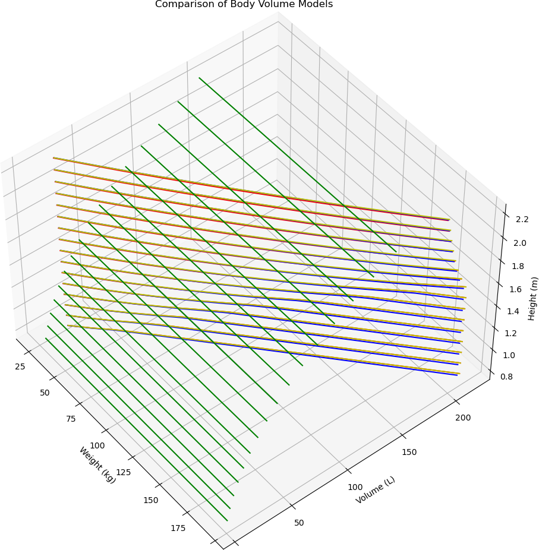

# Human Body Volume Calculation (Mostly for Cataclysm: Dark Days Ahead)

This repository contains a script that uses five different models to estimate the volume of a human body.

There is no guarantee that the results are accurate, or can be relied upon in any medical context, or even useful in a gaming context.

Also, this has been an unreasonable amount of work just to prove a point, and is unnecessarily detailed.

Anyway, To run the script, you need Python3 and matplotlib (just comment out the plotting business, if you
don't want to install matplotlib)

# Models

There are a couple of assumptions here:

* Volume = Weight / Density
* The larger the BMI of a human body, the larger ratio of fat to other components

The material composition of average humans is roughly

* 12% fat
* 65% water
* 20% protein
* 3% other stuff

The densities of each respective material are assumed to be

* Fat: 0.9 g/cm³ (kg/L)
* Water: 1.0 g/cm³ (kg/L)
* Protein: 1.35 g/cm³ (kg/L)
* Other: 1.0 g/cm³ (kg/L)

There are five models provided:

## CDDA Original

The original volume calculation from https://github.com/CleverRaven/Cataclysm-DDA/pull/74162)

This model only takes into account the height of the character to produce a volume.

## CDDA Simple

A proposed volume calculation model based on an online tool, found in https://github.com/CleverRaven/Cataclysm-DDA/pull/74348.

This model takes into account the weight and height of the character to produce a volume, with a calculation based on average human body density.

## BMI Model

Uses the calculations for producing body fat ratio from BMI, and then applying the average body density based on lipids, water, and protein onto the weight.

This model also adjusts for the proportions of each component (fat, water, protein, etc.) and adjusts the volume calculation accordingly, i.e. the more fat, the less density, the larger the volume.

This model also can account for age and gender, although the differences I've tested so far are minimal.

## Brozek Model

Uses the Brozek formula for body fat ratio, estimated from BMI. The Brozek model reputedly has ±1% accuracy against empirical methods such as water immersion.

This model also takes the proportion of fat vs. other components into account.

Where this model breaks down (outside of normal human heights/weights) the calculations are clamped either to zero for negative results, or to double the weight for huge volumes.

## Siri Model

An older model that used to be used in the same manner as the Brozek model, reputely has ±10% accuracy compared to empirical methods.

This model also takes the proportion of fat vs. other components into account, and uses the same capping strategy as above.

# Graph over relations between models and parameters

The green lines are the original CDDA volume calculation (independent of weight) results for various heighs.

The red lines are the BMI model results.

The blue lines are the Brozek model results.

The yellow lines are the Siri model results.

You can examine this graph better if you run the script yourself, where you can rotate and zoom in.

The graph shows (mostly) that the more sensitive the model is for weight, the larger the difference
between low and high body weight.

The BMI based models (including Brozek and Siri) all seem to produce volumes that inflated (*drum fill*) at
lower heights, the "BMI Model" less so.

It also shows that something weird is going on with the Brozek models and Siri models outside the normal
human size ranges.

# References

* https://www.ncbi.nlm.nih.gov/pmc/articles/PMC2286542/
* https://pubmed.ncbi.nlm.nih.gov/2596420/
* https://en.wikipedia.org/wiki/Body_fat_percentage
* https://en.wikipedia.org/wiki/Body_mass_index
* https://calculator.academy/body-volume-calculator/
* https://pubmed.ncbi.nlm.nih.gov/21085903/

# Results

Out of these models, the pure "BMI Model" (really just a simple volume = weight / density calculation) seems
to give reasonable results. The "Brozek" and "Siri" models break down when values are way outside normal
human weights and heights (other models must be used for infants, dissoluted devourers, and blobs, supposedly).

The classification is not meant to fat or thin shame anyone (real or imagined characters), but is the standard
classification that WHO uses (see https://en.wikipedia.org/wiki/Body_mass_index#Categories).

| Weight (kg) | Height (m) | CDDA (L) | CDDA Simple (L) | BMI Model (L) | Brozek Model (L) | Siri Model (L) | Classification    |
|-------------|------------|----------|-----------------|---------------|------------------|----------------|-------------------|
|          25 |       0.55 |     2.17 |           23.18 |         27.80 |            27.44 |          27.80 | Obese (Class III) |
|          25 |        0.7 |     4.48 |           23.22 |         25.55 |            25.39 |          25.53 | Obese (Class III) |
|          25 |        1.0 |    13.06 |           23.30 |         23.96 |            24.11 |          24.14 | Overweight        |
|          25 |       1.22 |    23.72 |           23.37 |         23.50 |            23.77 |          23.76 | Moderate thinness |
|          25 |        1.5 |    44.08 |           23.44 |         23.19 |            23.54 |          23.52 | Severe thinness   |
|          25 |       1.62 |    55.53 |           23.48 |         23.11 |            23.48 |          23.45 | Severe thinness   |
|          25 |       1.75 |    70.00 |           23.51 |         23.04 |            23.43 |          23.40 | Severe thinness   |
|          25 |        2.0 |   104.49 |           23.59 |         22.93 |            23.35 |          23.32 | Severe thinness   |
|          25 |       2.27 |   152.78 |           23.66 |         22.86 |            23.30 |          23.26 | Severe thinness   |
|          25 |       2.72 |   262.84 |           23.79 |         22.78 |            23.25 |          23.20 | Severe thinness   |
|          25 |        2.8 |   286.72 |           23.82 |         22.78 |            23.24 |          23.19 | Severe thinness   |

| Weight (kg) | Height (m) | CDDA (L) | CDDA Simple (L) | BMI Model (L) | Brozek Model (L) | Siri Model (L) | Classification    |
|-------------|------------|----------|-----------------|---------------|------------------|----------------|-------------------|
|          40 |       0.55 |     2.17 |           37.31 |         51.57 |            52.26 |          53.93 | Obese (Class III) |
|          40 |        0.7 |     4.48 |           37.38 |         44.35 |            43.79 |          44.34 | Obese (Class III) |
|          40 |        1.0 |    13.06 |           37.51 |         39.77 |            39.70 |          39.84 | Obese (Class III) |
|          40 |       1.22 |    23.72 |           37.61 |         38.51 |            38.72 |          38.77 | Overweight        |
|          40 |        1.5 |    44.08 |           37.74 |         37.69 |            38.09 |          38.09 | Mild thinness     |
|          40 |       1.62 |    55.53 |           37.80 |         37.47 |            37.93 |          37.91 | Severe thinness   |
|          40 |       1.75 |    70.00 |           37.86 |         37.28 |            37.79 |          37.76 | Severe thinness   |
|          40 |        2.0 |   104.49 |           37.97 |         37.01 |            37.60 |          37.55 | Severe thinness   |
|          40 |       2.27 |   152.78 |           38.10 |         36.82 |            37.46 |          37.41 | Severe thinness   |
|          40 |       2.72 |   262.84 |           38.31 |         36.62 |            37.32 |          37.25 | Severe thinness   |
|          40 |        2.8 |   286.72 |           38.34 |         36.60 |            37.30 |          37.23 | Severe thinness   |

| Weight (kg) | Height (m) | CDDA (L) | CDDA Simple (L) | BMI Model (L) | Brozek Model (L) | Siri Model (L) | Classification    |
|-------------|------------|----------|-----------------|---------------|------------------|----------------|-------------------|
|          55 |       0.55 |     2.17 |           51.60 |         84.37 |            97.42 |         104.93 | Obese (Class III) |
|          55 |        0.7 |     4.48 |           51.70 |         66.62 |            66.32 |          67.82 | Obese (Class III) |
|          55 |        1.0 |    13.06 |           51.89 |         56.80 |            56.36 |          56.72 | Obese (Class III) |
|          55 |       1.22 |    23.72 |           52.02 |         54.27 |            54.26 |          54.43 | Obese (Class II)  |
|          55 |        1.5 |    44.08 |           52.20 |         52.65 |            53.00 |          53.05 | Normal            |
|          55 |       1.62 |    55.53 |           52.28 |         52.21 |            52.67 |          52.69 | Normal            |
|          55 |       1.75 |    70.00 |           52.36 |         51.85 |            52.39 |          52.40 | Mild thinness     |
|          55 |        2.0 |   104.49 |           52.52 |         51.34 |            52.02 |          51.99 | Severe thinness   |
|          55 |       2.27 |   152.78 |           52.70 |         50.97 |            51.75 |          51.70 | Severe thinness   |
|          55 |       2.72 |   262.84 |           52.99 |         50.59 |            51.48 |          51.40 | Severe thinness   |
|          55 |        2.8 |   286.72 |           53.04 |         50.54 |            51.44 |          51.37 | Severe thinness   |

| Weight (kg) | Height (m) | CDDA (L) | CDDA Simple (L) | BMI Model (L) | Brozek Model (L) | Siri Model (L) | Classification    |
|-------------|------------|----------|-----------------|---------------|------------------|----------------|-------------------|
|          70 |       0.55 |     2.17 |           66.05 |        132.54 |           140.00 |         140.00 | Obese (Class III) |
|          70 |        0.7 |     4.48 |           66.17 |         93.44 |            96.17 |          99.84 | Obese (Class III) |
|          70 |        1.0 |    13.06 |           66.41 |         75.19 |            74.32 |          75.04 | Obese (Class III) |
|          70 |       1.22 |    23.72 |           66.59 |         70.83 |            70.50 |          70.84 | Obese (Class III) |
|          70 |        1.5 |    44.08 |           66.82 |         68.09 |            68.29 |          68.43 | Obese (Class I)   |
|          70 |       1.62 |    55.53 |           66.92 |         67.37 |            67.73 |          67.82 | Overweight        |
|          70 |       1.75 |    70.00 |           67.02 |         66.76 |            67.26 |          67.31 | Normal            |
|          70 |        2.0 |   104.49 |           67.23 |         65.91 |            66.63 |          66.63 | Mild thinness     |
|          70 |       2.27 |   152.78 |           67.45 |         65.31 |            66.19 |          66.15 | Severe thinness   |
|          70 |       2.72 |   262.84 |           67.83 |         64.69 |            65.73 |          65.66 | Severe thinness   |
|          70 |        2.8 |   286.72 |           67.90 |         64.61 |            65.68 |          65.60 | Severe thinness   |

| Weight (kg) | Height (m) | CDDA (L) | CDDA Simple (L) | BMI Model (L) | Brozek Model (L) | Siri Model (L) | Classification    |
|-------------|------------|----------|-----------------|---------------|------------------|----------------|-------------------|
|          85 |       0.55 |     2.17 |           80.64 |        170.00 |             0.00 |           0.00 | Obese (Class III) |
|          85 |        0.7 |     4.48 |           80.79 |        126.35 |           140.84 |         150.07 | Obese (Class III) |
|          85 |        1.0 |    13.06 |           81.08 |         95.13 |            93.93 |          95.20 | Obese (Class III) |
|          85 |       1.22 |    23.72 |           81.30 |         88.25 |            87.51 |          88.11 | Obese (Class III) |
|          85 |        1.5 |    44.08 |           81.58 |         84.04 |            84.00 |          84.26 | Obese (Class II)  |
|          85 |       1.62 |    55.53 |           81.70 |         82.94 |            83.12 |          83.31 | Obese (Class I)   |
|          85 |       1.75 |    70.00 |           81.84 |         82.02 |            82.40 |          82.53 | Overweight        |
|          85 |        2.0 |   104.49 |           82.09 |         80.75 |            81.44 |          81.48 | Normal            |
|          85 |       2.27 |   152.78 |           82.36 |         79.85 |            80.77 |          80.75 | Moderate thinness |
|          85 |       2.72 |   262.84 |           82.83 |         78.92 |            80.09 |          80.02 | Severe thinness   |
|          85 |        2.8 |   286.72 |           82.91 |         78.81 |            80.00 |          79.92 | Severe thinness   |

| Weight (kg) | Height (m) | CDDA (L) | CDDA Simple (L) | BMI Model (L) | Brozek Model (L) | Siri Model (L) | Classification    |
|-------------|------------|----------|-----------------|---------------|------------------|----------------|-------------------|
|         100 |       0.55 |     2.17 |           95.37 |        200.00 |             0.00 |           0.00 | Obese (Class III) |
|         100 |        0.7 |     4.48 |           95.54 |        167.69 |           200.00 |         200.00 | Obese (Class III) |
|         100 |        1.0 |    13.06 |           95.90 |        116.81 |           115.64 |         117.74 | Obese (Class III) |
|         100 |       1.22 |    23.72 |           96.16 |        106.61 |           105.44 |         106.39 | Obese (Class III) |
|         100 |        1.5 |    44.08 |           96.49 |        100.53 |           100.16 |         100.60 | Obese (Class III) |
|         100 |       1.62 |    55.53 |           96.63 |         98.96 |            98.89 |          99.20 | Obese (Class II)  |
|         100 |       1.75 |    70.00 |           96.79 |         97.64 |            97.84 |          98.07 | Obese (Class I)   |
|         100 |        2.0 |   104.49 |           97.09 |         95.85 |            96.46 |          96.56 | Overweight        |
|         100 |       2.27 |   152.78 |           97.42 |         94.59 |            95.50 |          95.52 | Normal            |
|         100 |       2.72 |   262.84 |           97.97 |         93.29 |            94.54 |          94.48 | Severe thinness   |
|         100 |        2.8 |   286.72 |           98.07 |         93.13 |            94.42 |          94.35 | Severe thinness   |

| Weight (kg) | Height (m) | CDDA (L) | CDDA Simple (L) | BMI Model (L) | Brozek Model (L) | Siri Model (L) | Classification    |
|-------------|------------|----------|-----------------|---------------|------------------|----------------|-------------------|
|         115 |       0.55 |     2.17 |          110.22 |        230.00 |             0.00 |           0.00 | Obese (Class III) |
|         115 |        0.7 |     4.48 |          110.43 |        221.18 |           230.00 |         230.00 | Obese (Class III) |
|         115 |        1.0 |    13.06 |          110.84 |        140.48 |           140.08 |         143.42 | Obese (Class III) |
|         115 |       1.22 |    23.72 |          111.14 |        125.98 |           124.41 |         125.84 | Obese (Class III) |
|         115 |        1.5 |    44.08 |          111.53 |        117.58 |           116.83 |         117.49 | Obese (Class III) |
|         115 |       1.62 |    55.53 |          111.69 |        115.43 |           115.04 |         115.53 | Obese (Class III) |
|         115 |       1.75 |    70.00 |          111.87 |        113.64 |           113.59 |         113.95 | Obese (Class II)  |
|         115 |        2.0 |   104.49 |          112.22 |        111.23 |           111.69 |         111.88 | Overweight        |
|         115 |       2.27 |   152.78 |          112.60 |        109.53 |           110.39 |         110.47 | Normal            |
|         115 |       2.72 |   262.84 |          113.25 |        107.79 |           109.10 |         109.06 | Severe thinness   |
|         115 |        2.8 |   286.72 |          113.36 |        107.57 |           108.93 |         108.89 | Severe thinness   |

| Weight (kg) | Height (m) | CDDA (L) | CDDA Simple (L) | BMI Model (L) | Brozek Model (L) | Siri Model (L) | Classification    |
|-------------|------------|----------|-----------------|---------------|------------------|----------------|-------------------|
|         130 |       0.55 |     2.17 |          125.20 |        260.00 |             0.00 |           0.00 | Obese (Class III) |
|         130 |        0.7 |     4.48 |          125.43 |        260.00 |             0.00 |           0.00 | Obese (Class III) |
|         130 |        1.0 |    13.06 |          125.90 |        166.41 |           168.20 |         173.37 | Obese (Class III) |
|         130 |       1.22 |    23.72 |          126.24 |        146.45 |           144.63 |         146.68 | Obese (Class III) |
|         130 |        1.5 |    44.08 |          126.69 |        135.21 |           134.05 |         134.98 | Obese (Class III) |
|         130 |       1.62 |    55.53 |          126.88 |        132.38 |           131.62 |         132.32 | Obese (Class III) |
|         130 |       1.75 |    70.00 |          127.08 |        130.04 |           129.68 |         130.20 | Obese (Class III) |
|         130 |        2.0 |   104.49 |          127.48 |        126.89 |           127.16 |         127.45 | Obese (Class I)   |
|         130 |       2.27 |   152.78 |          127.92 |        124.68 |           125.45 |         125.59 | Overweight        |
|         130 |       2.72 |   262.84 |          128.65 |        122.43 |           123.76 |         123.75 | Mild thinness     |
|         130 |        2.8 |   286.72 |          128.78 |        122.15 |           123.54 |         123.52 | Moderate thinness |

| Weight (kg) | Height (m) | CDDA (L) | CDDA Simple (L) | BMI Model (L) | Brozek Model (L) | Siri Model (L) | Classification    |
|-------------|------------|----------|-----------------|---------------|------------------|----------------|-------------------|
|         145 |       0.55 |     2.17 |          140.28 |          0.00 |            13.33 |          12.40 | Obese (Class III) |
|         145 |        0.7 |     4.48 |          140.55 |        290.00 |             0.00 |           0.00 | Obese (Class III) |
|         145 |        1.0 |    13.06 |          141.07 |        194.95 |           201.38 |         209.36 | Obese (Class III) |
|         145 |       1.22 |    23.72 |          141.46 |        168.11 |           166.30 |         169.18 | Obese (Class III) |
|         145 |        1.5 |    44.08 |          141.96 |        153.47 |           151.87 |         153.14 | Obese (Class III) |
|         145 |       1.62 |    55.53 |          142.17 |        149.83 |           148.66 |         149.62 | Obese (Class III) |
|         145 |       1.75 |    70.00 |          142.41 |        146.84 |           146.12 |         146.84 | Obese (Class III) |
|         145 |        2.0 |   104.49 |          142.86 |        142.83 |           142.86 |         143.27 | Obese (Class II)  |
|         145 |       2.27 |   152.78 |          143.34 |        140.04 |           140.67 |         140.89 | Overweight        |
|         145 |       2.72 |   262.84 |          144.17 |        137.21 |           138.52 |         138.56 | Normal            |
|         145 |        2.8 |   286.72 |          144.31 |        136.86 |           138.26 |         138.27 | Mild thinness     |

| Weight (kg) | Height (m) | CDDA (L) | CDDA Simple (L) | BMI Model (L) | Brozek Model (L) | Siri Model (L) | Classification    |
|-------------|------------|----------|-----------------|---------------|------------------|----------------|-------------------|
|         160 |       0.55 |     2.17 |          155.47 |          0.00 |            28.32 |          26.52 | Obese (Class III) |
|         160 |        0.7 |     4.48 |          155.76 |        320.00 |             0.00 |           0.00 | Obese (Class III) |
|         160 |        1.0 |    13.06 |          156.35 |        226.52 |           241.85 |         254.27 | Obese (Class III) |
|         160 |       1.22 |    23.72 |          156.78 |        191.07 |           189.72 |         193.67 | Obese (Class III) |
|         160 |        1.5 |    44.08 |          157.33 |        172.38 |           170.36 |         172.05 | Obese (Class III) |
|         160 |       1.62 |    55.53 |          157.57 |        167.80 |           166.20 |         167.47 | Obese (Class III) |
|         160 |       1.75 |    70.00 |          157.83 |        164.06 |           162.95 |         163.90 | Obese (Class III) |
|         160 |        2.0 |   104.49 |          158.33 |        159.07 |           158.82 |         159.38 | Obese (Class III) |
|         160 |       2.27 |   152.78 |          158.88 |        155.62 |           156.07 |         156.39 | Obese (Class I)   |
|         160 |       2.72 |   262.84 |          159.79 |        152.14 |           153.40 |         153.49 | Normal            |
|         160 |        2.8 |   286.72 |          159.96 |        151.70 |           153.07 |         153.13 | Normal            |

| Weight (kg) | Height (m) | CDDA (L) | CDDA Simple (L) | BMI Model (L) | Brozek Model (L) | Siri Model (L) | Classification    |
|-------------|------------|----------|-----------------|---------------|------------------|----------------|-------------------|
|         175 |       0.55 |     2.17 |          170.75 |          0.00 |            41.18 |          38.75 | Obese (Class III) |
|         175 |        0.7 |     4.48 |          171.07 |        350.00 |             0.00 |           0.00 | Obese (Class III) |
|         175 |        1.0 |    13.06 |          171.72 |        261.62 |           293.35 |         313.15 | Obese (Class III) |
|         175 |       1.22 |    23.72 |          172.19 |        215.46 |           215.25 |         220.60 | Obese (Class III) |
|         175 |        1.5 |    44.08 |          172.80 |        191.98 |           189.58 |         191.78 | Obese (Class III) |
|         175 |       1.62 |    55.53 |          173.07 |        186.32 |           184.29 |         185.92 | Obese (Class III) |
|         175 |       1.75 |    70.00 |          173.35 |        181.72 |           180.19 |         181.41 | Obese (Class III) |
|         175 |        2.0 |   104.49 |          173.91 |        175.62 |           175.04 |         175.77 | Obese (Class III) |
|         175 |       2.27 |   152.78 |          174.51 |        171.42 |           171.65 |         172.08 | Obese (Class I)   |
|         175 |       2.72 |   262.84 |          175.52 |        167.21 |           168.39 |         168.54 | Normal            |
|         175 |        2.8 |   286.72 |          175.70 |        166.68 |           167.99 |         168.10 | Normal            |

| Weight (kg) | Height (m) | CDDA (L) | CDDA Simple (L) | BMI Model (L) | Brozek Model (L) | Siri Model (L) | Classification    |
|-------------|------------|----------|-----------------|---------------|------------------|----------------|-------------------|
|         190 |       0.55 |     2.17 |          186.11 |          0.00 |            52.78 |          49.85 | Obese (Class III) |
|         190 |        0.7 |     4.48 |          186.46 |        380.00 |             0.00 |           0.00 | Obese (Class III) |
|         190 |        1.0 |    13.06 |          187.17 |        300.88 |           362.71 |         380.00 | Obese (Class III) |
|         190 |       1.22 |    23.72 |          187.69 |        241.40 |           243.37 |         250.56 | Obese (Class III) |
|         190 |        1.5 |    44.08 |          188.36 |        212.31 |           209.63 |         212.44 | Obese (Class III) |
|         190 |       1.62 |    55.53 |          188.64 |        205.41 |           202.96 |         205.04 | Obese (Class III) |
|         190 |       1.75 |    70.00 |          188.96 |        199.83 |           197.86 |         199.42 | Obese (Class III) |
|         190 |        2.0 |   104.49 |          189.56 |        192.48 |           191.54 |         192.47 | Obese (Class III) |
|         190 |       2.27 |   152.78 |          190.22 |        187.45 |           187.43 |         187.99 | Obese (Class II)  |
|         190 |       2.72 |   262.84 |          191.32 |        182.42 |           183.50 |         183.71 | Overweight        |
|         190 |        2.8 |   286.72 |          191.52 |        181.79 |           183.02 |         183.19 | Normal            |

| Weight (kg) | Height (m) | CDDA (L) | CDDA Simple (L) | BMI Model (L) | Brozek Model (L) | Siri Model (L) | Classification    |
|-------------|------------|----------|-----------------|---------------|------------------|----------------|-------------------|
|         205 |       0.55 |     2.17 |          201.54 |          0.00 |            63.58 |          60.20 | Obese (Class III) |
|         205 |        0.7 |     4.48 |          201.92 |        410.00 |             0.00 |           0.00 | Obese (Class III) |
|         205 |        1.0 |    13.06 |          202.69 |        345.10 |           410.00 |         410.00 | Obese (Class III) |
|         205 |       1.22 |    23.72 |          203.25 |        269.06 |           274.69 |         284.31 | Obese (Class III) |
|         205 |        1.5 |    44.08 |          203.98 |        233.41 |           230.60 |         234.13 | Obese (Class III) |
|         205 |       1.62 |    55.53 |          204.29 |        225.10 |           222.28 |         224.88 | Obese (Class III) |
|         205 |       1.75 |    70.00 |          204.63 |        218.41 |           216.01 |         217.94 | Obese (Class III) |
|         205 |        2.0 |   104.49 |          205.29 |        209.67 |           208.33 |         209.50 | Obese (Class III) |
|         205 |       2.27 |   152.78 |          206.00 |        203.70 |           203.40 |         204.11 | Obese (Class II)  |
|         205 |       2.72 |   262.84 |          207.21 |        197.78 |           198.72 |         199.02 | Overweight        |
|         205 |        2.8 |   286.72 |          207.42 |        197.04 |           198.15 |         198.40 | Overweight        |

