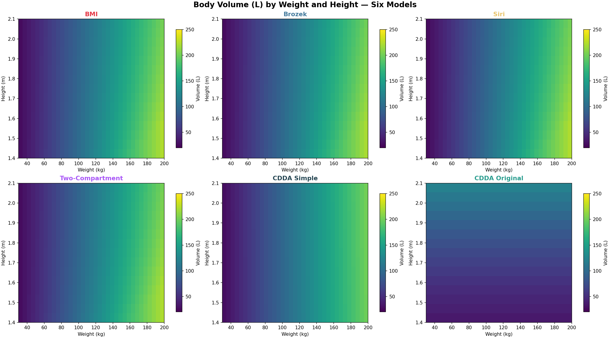
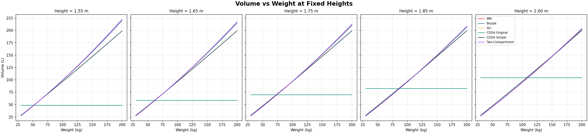
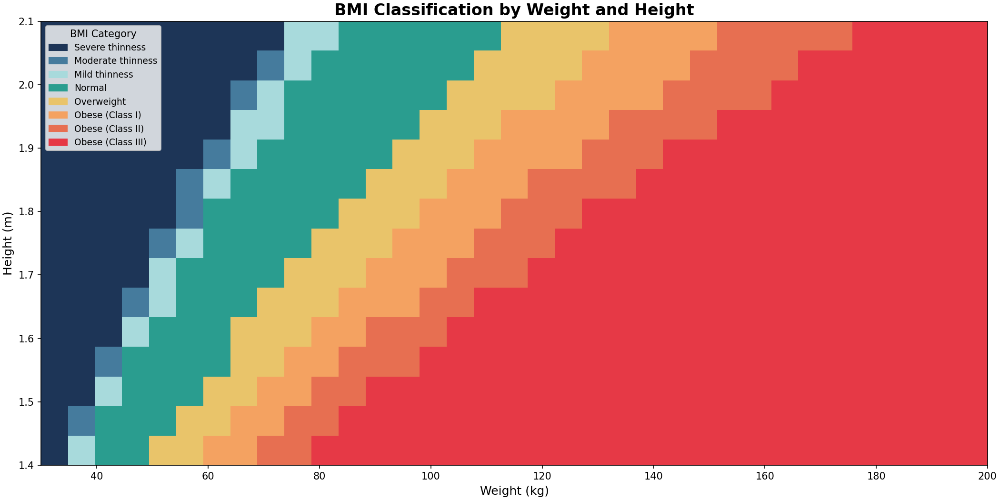
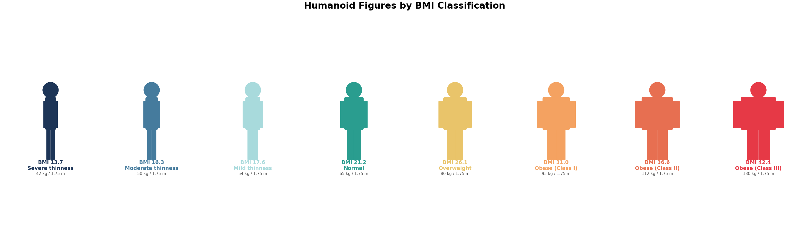
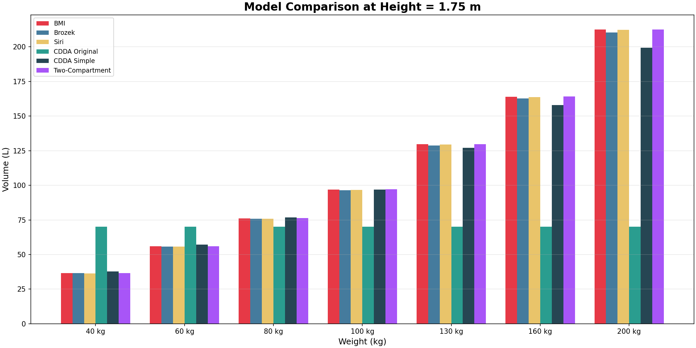

# Body Volume Calculation — Model Comparison Report

This document compares six body-volume calculation models across a
range of heights and weights.  All graphs use **weight on the X axis**
and **height on the Y axis** (where applicable).  The models compared
are:

| Model | Inputs | Notes |
|-------|--------|-------|
| **BMI** | Height, Weight, Gender, Age | Uses Deurenberg BMI→fat ratio then 4-compartment density |
| **Brozek** | Height, Weight, Gender, Age | Iterative Brozek body-fat formula |
| **Siri** | Height, Weight, Gender, Age | Iterative Siri body-fat formula |
| **Two-Compartment** | Height, Weight, Gender | Direct Siri 1961 two-compartment physics model |
| **CDDA Simple** | Height, Weight | Empirical density regression for game use |
| **CDDA Original** | Height only | Cubic height scaling (no weight dependence) |

All calculations assume a **30-year-old male** unless noted otherwise.

---

## 1. Volume Heatmaps

Each panel shows the predicted body volume (litres) as a colour map,
with weight on the X axis and height on the Y axis.

**Key observations:**
- The BMI, Brozek, Siri, and Two-Compartment models produce very
  similar gradients — volume increases with both weight and height.
- The CDDA Original model shows **horizontal bands** because it
  ignores weight entirely.
- The CDDA Simple model diverges noticeably at extreme weights.

---

## 2. Volume vs Weight at Fixed Heights

Line plots comparing all six models at five representative heights.

**Key observations:**
- All weight-dependent models show a roughly linear relationship.
- The CDDA Original line is flat (weight-independent).
- Model agreement is best in the normal weight range (60–90 kg)
  and diverges at extremes.

---

## 3. BMI Classification Map

A colour-coded map showing the WHO BMI classification at each
weight/height combination.

---

## 4. Humanoid Figure Illustrations

Stylised humanoid silhouettes whose body width reflects the BMI
classification, from *Severe thinness* to *Obese (Class III)*.

---

## 5. Model Comparison (Bar Chart)

Side-by-side bar chart of all six models at height 1.75 m for
selected weights.

---

## 6. Detailed Comparison Tables

The tables below show numerical results for each model at selected
height/weight combinations.

#### Height = 1.50 m

| Weight (kg) | BMI | Category | BMI Vol (L) | Brozek Vol (L) | Siri Vol (L) | 2-Comp Vol (L) | CDDA Simple (L) | CDDA Original (L) |
|---|---|---|---|---|---|---|---|---|
| 50 | 22.2 | Normal | 47.0 | 46.8 | 46.8 | 47.1 | 47.4 | 44.1 |
| 60 | 26.7 | Overweight | 57.1 | 56.9 | 56.9 | 57.3 | 57.1 | 44.1 |
| 70 | 31.1 | Obese (Class I) | 67.5 | 67.2 | 67.3 | 67.7 | 66.8 | 44.1 |
| 80 | 35.6 | Obese (Class II) | 78.2 | 77.8 | 78.0 | 78.3 | 76.6 | 44.1 |
| 90 | 40.0 | Obese (Class III) | 89.1 | 88.6 | 88.9 | 89.3 | 86.5 | 44.1 |
| 100 | 44.4 | Obese (Class III) | 100.3 | 99.6 | 100.1 | 100.4 | 96.5 | 44.1 |
| 120 | 53.3 | Obese (Class III) | 123.4 | 122.4 | 123.2 | 123.5 | 116.6 | 44.1 |
| 150 | 66.7 | Obese (Class III) | 159.9 | 158.3 | 159.8 | 159.9 | 147.1 | 44.1 |

#### Height = 1.62 m

| Weight (kg) | BMI | Category | BMI Vol (L) | Brozek Vol (L) | Siri Vol (L) | 2-Comp Vol (L) | CDDA Simple (L) | CDDA Original (L) |
|---|---|---|---|---|---|---|---|---|
| 50 | 19.1 | Normal | 46.5 | 46.4 | 46.3 | 46.7 | 47.4 | 55.5 |
| 60 | 22.9 | Normal | 56.5 | 56.3 | 56.3 | 56.6 | 57.1 | 55.5 |
| 70 | 26.7 | Overweight | 66.6 | 66.4 | 66.4 | 66.8 | 66.9 | 55.5 |
| 80 | 30.5 | Obese (Class I) | 77.0 | 76.7 | 76.8 | 77.2 | 76.8 | 55.5 |
| 90 | 34.3 | Obese (Class I) | 87.6 | 87.2 | 87.4 | 87.8 | 86.7 | 55.5 |
| 100 | 38.1 | Obese (Class II) | 98.5 | 97.9 | 98.2 | 98.6 | 96.6 | 55.5 |
| 120 | 45.7 | Obese (Class III) | 120.8 | 119.9 | 120.5 | 120.9 | 116.7 | 55.5 |
| 150 | 57.2 | Obese (Class III) | 155.8 | 154.5 | 155.7 | 155.9 | 147.3 | 55.5 |

#### Height = 1.75 m

| Weight (kg) | BMI | Category | BMI Vol (L) | Brozek Vol (L) | Siri Vol (L) | 2-Comp Vol (L) | CDDA Simple (L) | CDDA Original (L) |
|---|---|---|---|---|---|---|---|---|
| 50 | 16.3 | Moderate thinness | 46.1 | 46.0 | 45.9 | 46.3 | 47.5 | 70.0 |
| 60 | 19.6 | Normal | 55.9 | 55.8 | 55.7 | 56.1 | 57.2 | 70.0 |
| 70 | 22.9 | Normal | 65.9 | 65.7 | 65.7 | 66.1 | 67.0 | 70.0 |
| 80 | 26.1 | Overweight | 76.0 | 75.7 | 75.8 | 76.2 | 76.9 | 70.0 |
| 90 | 29.4 | Overweight | 86.4 | 86.0 | 86.1 | 86.6 | 86.8 | 70.0 |
| 100 | 32.7 | Obese (Class I) | 96.9 | 96.4 | 96.6 | 97.1 | 96.8 | 70.0 |
| 120 | 39.2 | Obese (Class II) | 118.5 | 117.8 | 118.3 | 118.7 | 116.9 | 70.0 |
| 150 | 49.0 | Obese (Class III) | 152.3 | 151.2 | 152.1 | 152.5 | 147.5 | 70.0 |

#### Height = 1.85 m

| Weight (kg) | BMI | Category | BMI Vol (L) | Brozek Vol (L) | Siri Vol (L) | 2-Comp Vol (L) | CDDA Simple (L) | CDDA Original (L) |
|---|---|---|---|---|---|---|---|---|
| 50 | 14.6 | Severe thinness | 45.9 | 45.8 | 45.7 | 46.0 | 47.6 | 82.7 |
| 60 | 17.5 | Mild thinness | 55.5 | 55.4 | 55.3 | 55.7 | 57.3 | 82.7 |
| 70 | 20.5 | Normal | 65.4 | 65.2 | 65.2 | 65.6 | 67.1 | 82.7 |
| 80 | 23.4 | Normal | 75.4 | 75.2 | 75.2 | 75.6 | 77.0 | 82.7 |
| 90 | 26.3 | Overweight | 85.6 | 85.3 | 85.3 | 85.8 | 86.9 | 82.7 |
| 100 | 29.2 | Overweight | 95.9 | 95.5 | 95.6 | 96.2 | 96.9 | 82.7 |
| 120 | 35.1 | Obese (Class II) | 117.1 | 116.5 | 116.8 | 117.3 | 117.1 | 82.7 |
| 150 | 43.8 | Obese (Class III) | 150.1 | 149.2 | 149.8 | 150.4 | 147.7 | 82.7 |

#### Height = 2.00 m

| Weight (kg) | BMI | Category | BMI Vol (L) | Brozek Vol (L) | Siri Vol (L) | 2-Comp Vol (L) | CDDA Simple (L) | CDDA Original (L) |
|---|---|---|---|---|---|---|---|---|
| 50 | 12.5 | Severe thinness | 45.6 | 45.5 | 45.4 | 45.7 | 47.7 | 104.5 |
| 60 | 15.0 | Severe thinness | 55.1 | 55.0 | 54.9 | 55.3 | 57.4 | 104.5 |
| 70 | 17.5 | Mild thinness | 64.8 | 64.7 | 64.6 | 65.0 | 67.2 | 104.5 |
| 80 | 20.0 | Normal | 74.6 | 74.4 | 74.4 | 74.9 | 77.1 | 104.5 |
| 90 | 22.5 | Normal | 84.6 | 84.3 | 84.3 | 84.8 | 87.1 | 104.5 |
| 100 | 25.0 | Overweight | 94.7 | 94.4 | 94.4 | 95.0 | 97.1 | 104.5 |
| 120 | 30.0 | Obese (Class I) | 115.4 | 114.9 | 115.0 | 115.6 | 117.3 | 104.5 |
| 150 | 37.5 | Obese (Class II) | 147.4 | 146.6 | 147.1 | 147.7 | 148.0 | 104.5 |
